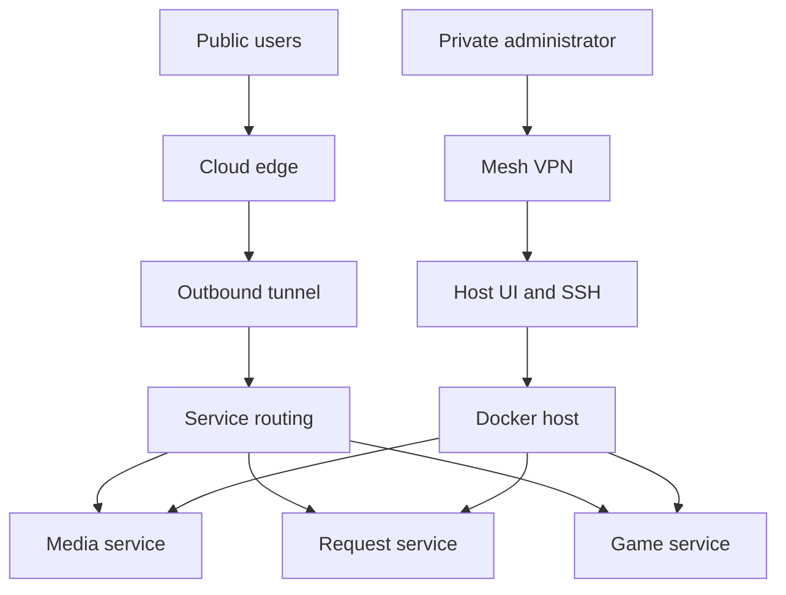

# System overview

The diagram below shows the two access paths through the lab: a public path that
reaches a small, explicitly listed set of applications, and a private path used
only for host administration.

The two paths never meet: public traffic reaches applications only, and the host
administration interface is reachable only over the mesh VPN.

This diagram intentionally uses generic components. It does not represent a live
hostname, IP address, domain, tunnel, port map, or access policy.
